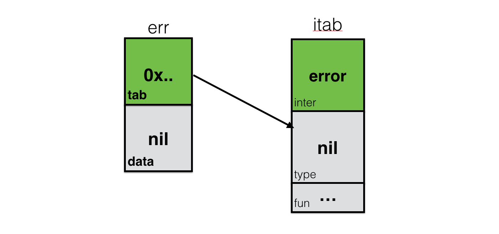
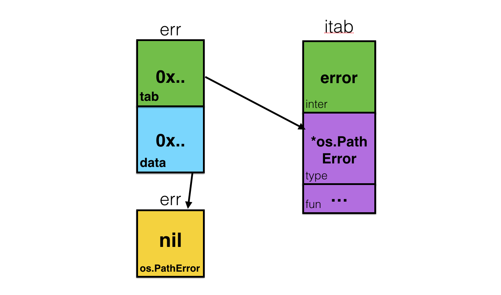

### Golang interface 避坑
带着疑问看问题

---

#### interface 底层里[有什么](https://golang.org/src/runtime/runtime2.go#L192)？
```go
type iface struct {
	tab  *itab
	data unsafe.Pointer
}
```
itab 表示 interface table，它是一个保存接口和底层类型所需元数据的[数据结构](https://golang.org/src/runtime/runtime2.go#L730):
```go
type itab struct {
	inter *interfacetype
	_type *_type
	hash  uint32 // copy of _type.hash. Used for type switches.
	_     [4]byte
	fun   [1]uintptr // variable sized. fun[0]==0 means _type does not implement inter.
}
```
#### interface 是什么？
- `interface` 是接口和静态类型信息加上指向实际变量的指针的复合体（`iface` 中的 `data` 字段）。创建一个 `error` 类型的变量：

<p align='center'>

</p>

这里创建的 `error` 类型的 `err` 就是一个 `nil interface`。它包含了接口的信息（itab.inter），但 data 字段和 itab.type 的值为 nil。当你使用 if err == nil {} 做判断时，这个对象会被判定为 true。

- 一个值为 nil 的 *os.PathError 类型变量
```go
func foo() error {
    var err *os.PathError // nil
    return err
}
err := foo()
if err == nil {...} // false
```
<p align='center'>

</p>

可以清楚的看到 `*os.PathError` - 只是一块存放了 `nil` 值的内存块，因为指针的零值就是 `nil`。但实际上 foo() 返回的 error 是一个包含了关于接口、接口类型、以及存放了 `nil` 值的内存地址等信息的更复杂的结构。发现不一样的地方了么？

在上面两个例子里，我们都创建了 `nil`，但在 包含了一个值为 `nil` 的变量的接口 和 不包含变量的接口 间存在着巨大的区别。也就是 data 中没有值的时候 `err == nil` 为 true，data 中有值，虽然值为 `nil`，但是 `err == nil` 为 true。

#### 空接口
