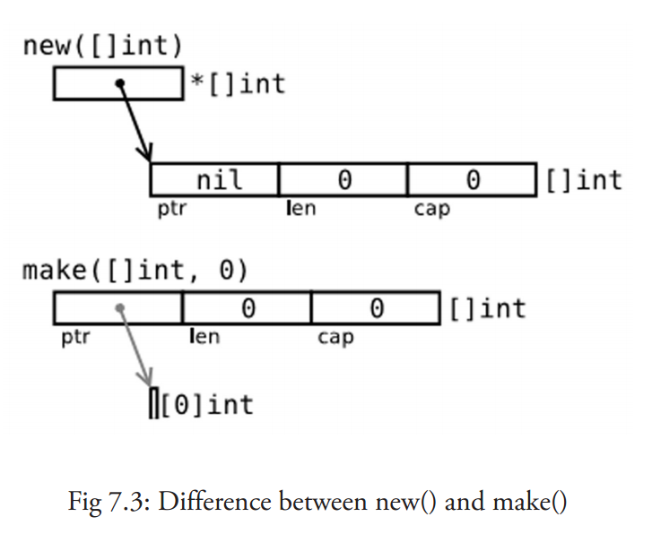

## 一. Golang 中的 make() 和 new()

Golang 中提供了两种分配原语：make、new，他们所做的事情不一样，所应用的类型也不同。先看下面一段代码
```go
var i *int
*i = 10
fmt.Println(i) //panic: runtime error: invalid memory address or nil pointer dereference
```
#### 为什么会 panic ？
`var i *int` 这里只是声明一个指针类型的变量, 并没有分配内存, 所以在 `*i = 10` 赋值的时候没有地方放这个值才会报错, 当然上面的是对于引用类型而言, 对于值类型默认帮我们分配了内存。

### 1. new()
使用 new 来分配内存，不会初始化内存，只会将内存置零（内存的分配与初始化在后文会讲到）。`new` 开辟一块内存并返回该内存的地址，new 不仅可以为简单类型开辟内存，也可以为复合引用类型开辟，不过后者初始化的零值还是 `nil` 。
```go
var i *int
i = new(int) // 返回的是内存地址的指针 同时请注意它同时把分配的内存置为零，也就是类型的零值
*i = 10 // 如果没有这句 则打印的为 0 ,int 类型的零值为 0
fmt.Println(i)
```

#### 使用 new 分配内存的好处
```go
type user struct {
    lock sync.Mutex
    name string
    age int
}

func main() {
    u := new(user)
    u.lock.lock()
    u.name = "passenger"
    u.age = 23
}
```
示例中的 `user` 类型中的 `lock` 字段不用初始化，可以直接拿来用，不会有无效内存引用异常，因为它已经被零值了。
### 2. make()
make 也是用于内存分配的，但是和 new 不同，它只用于 chan、map、slice 的内存创建，而且它返回的类型就是这三个类型本身，而不是他们的指针类型，因为这三种类型就是引用类型，所以就没有必要返回他们的指针了。

### 3. 二者的异同
二者都是内存的分配（堆上），但是make只用于 slice、map以及channel 的初始化（非零值），而 new 用于类型的内存分配，并且内存置为零。make 返回的还是这三个引用类型本身；而 new 返回的是指向类型的指针。
new 其实不常用，在平常的使用中更多的是直接使用段语句或者字面量来声明。
```go
func main() {
    p := new([]int) //p == nil; with len and cap 0
    fmt.Println(p)

    v := make([]int, 10, 50) // v is initialed with len 10, cap 50
    fmt.Println(v)

    /*********Output****************
        &[]
        [0 0 0 0 0 0 0 0 0 0]
    *********************************/

    (*p)[0] = 18        // panic: runtime error: index out of range
                        // because p is a nil pointer, with len and cap 0
    v[1] = 18           // ok

}
```

### 二. 内存的分配与初始化
内存的分配非常复杂，后面会再单独理解。这里的初始化可以简单理解为赋初始值的过程。
<p align='center'>

</p>