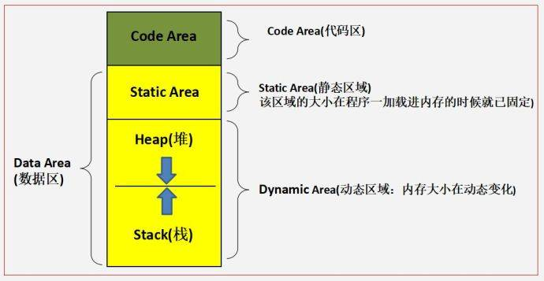

### 由变量名在内存中的存储位置引发的思考  
当我们写下 `var name string` 时是否思考过 `name` 是存放在内存中哪个区域的呢？  

---  

### 动态语言与静态语言的中变量名和变量的存储
- 静态语言
    例如 C 语言，需要将代码编译成二进制的可执行文件，之后运行可执行文件，执行时不需要像动态语言一样每次都要将代码转换成机器码，执行效率高。
- 动态语言
    例如 PHP、JavaScript，通过特定的解释器，一行一行实时翻译成一种中间代码，一行一行运行。运行效率可想而知不如静态语言。
通过简单了解动态语言和静态语言的区别是为了说明，他们之间变量与变量名的存储是由区别的。
### 动态语言以 C 语言为例
C 语言中变量在内存中的存储
- 栈区（stack）:由编译器自动分配释放 ，存放为运行函数而分配的局部变量、函数参数、返回数据、返回地址等。
- 堆区（heap）:一般由程序员分配释放， 用来存储数组，结构体，对象等。若程序员不释放，程序结束时可能由OS回收。
- 全局区（静态区）（static）:存放全局变量、静态数据、常量。程序结束后由系统释放。
- 文字常量区:常量字符串就是放在这里的。 程序结束后由系统释放。
- 程序代码区:存放函数体（类成员函数和全局函数）的二进制代码。
<p align='center'></p>  

- 栈内存空间是有限制的，默认情况下 Linux 平台是 8M，如果超过这个限制就会出现 `stackoverflow`。但是堆内存区域就没有限制，内存有多大就可以申请多大。  

下面用一段代码来说明 C 语言中变量的存放  

```c
#include <stdio.h>

int a = 1; //全局初始化区

int main(int argc, char const *argv[])
{
    int b; //栈
    b = a + 5;
    printf("%d\n", b);
    return 0;
}
``` 
C 语言执行的几个步骤
- 预处理（Preprocessing）
- 编译（Compilation）
- 汇编（Assemble）
- 链接（Linking）  

在编译成汇编语言的过程中就已经没有变量名了，使用 gdb 查看编译后的汇编代码
```c
   (gdb) disass main
Dump of assembler code for function main:
   0x0000000000400526 <+0>:	push   %rbp
   0x0000000000400527 <+1>:	mov    %rsp,%rbp
   0x000000000040052a <+4>:	sub    $0x20,%rsp
   0x000000000040052e <+8>:	mov    %edi,-0x14(%rbp)
   0x0000000000400531 <+11>:	mov    %rsi,-0x20(%rbp)
   0x0000000000400535 <+15>:	mov    0x200afd(%rip),%eax        # 0x601038 <a>
   0x000000000040053b <+21>:	add    $0x5,%eax
   0x000000000040053e <+24>:	mov    %eax,-0x4(%rbp)
   0x0000000000400541 <+27>:	mov    -0x4(%rbp),%eax
   0x0000000000400544 <+30>:	mov    %eax,%esi
   0x0000000000400546 <+32>:	mov    $0x4005e4,%edi
   0x000000000040054b <+37>:	mov    $0x0,%eax
   0x0000000000400550 <+42>:	callq  0x400400 <printf@plt>
=> 0x0000000000400555 <+47>:	mov    $0x0,%eax
   0x000000000040055a <+52>:	leaveq 
   0x000000000040055b <+53>:	retq   
End of assembler dump.
```

所有的变量名最后都变成了内存地址，汇编指令操作的是各种寄存器和内存地址。(所以变量名字越长越占空间的说法并不准确，只占用存储代码文本的空间，在内存中最后都变成了内存地址)
>定义int a;时,编译器分配4个字节内存,并命名该4个字节的空间名字为a(即变量名),当用到变量名a时,就是在使用那4个字节的内存空间。 5是一个常数,在程序编译时存放在代码的常量区存放着它的值(就是5),当执行a=5时,程序将5这个常量拷贝到a所在的4个字节空间中,就完成了赋值操作.a是我们对那个整形变量的4个字节取的"名字",是我们人为给的,实际上计算机并不存储a这个名字,只是我们编程时给那4个字节内存取个名字好用。实际上程序在编译时,所有的a都转换为了那个地址空间了,编译成机器代码后,没有a这个说法了。a这个名字只存在于我们编写的代码中.5不是被随机分配的,而总是位于程序的数据段中,可能在不同的机器上在数据段中的位置可能不一致,它的地址其实不能以我们常用到的内存地址来理解,因为牵扯到一个叫"计算机寻址方式"的问题。  

需要注意的是，在操作系统中所指的内存地址并不是实际的物理地址，而是通过基址 + 偏移量的方式来计算得到的虚拟地址。  

---

### 静态语言以 PHP 为例
PHP 执行的几个步骤  

- zend 引擎进行词法分析语法分析
- 编译成 OPCode
- zend 引擎执行 OPCode

```php
<?php
$a = 1;
$b = 2;

function hello($d,$e)
{
    $c = $d+$e;
}

hello($a, $b);
```  
使用 [vld](https://gywbd.github.io/posts/2016/2/vld-opcode.html) 查看 OPCode  

```shell
~$ php7.0 -dvld.active=1 ~/test.php 
Finding entry points
Branch analysis from position: 0
1 jumps found. (Code = 62) Position 1 = -2
filename:       /home/jwang/index.php
function name:  (null)
number of ops:  14
compiled vars:  !0 = $a, !1 = $b
line     #* E I O op                           fetch          ext  return  operands
-------------------------------------------------------------------------------------
   2     0  E >   EXT_STMT                                                 
         1        ASSIGN                                                   !0, 1
   3     2        EXT_STMT                                                 
         3        ASSIGN                                                   !1, 2
   5     4        EXT_STMT                                                 
         5        NOP                                                      
  10     6        EXT_STMT                                                 
         7        INIT_FCALL                                               'hello'
         8        EXT_FCALL_BEGIN                                          
         9        SEND_VAR                                                 !0
        10        SEND_VAR                                                 !1
        11        DO_FCALL                                      0          
        12        EXT_FCALL_END                                            
  11    13      > RETURN                                                   1

branch: #  0; line:     2-   11; sop:     0; eop:    13; out0:  -2
path #1: 0, 
Function hello:
Finding entry points
Branch analysis from position: 0
1 jumps found. (Code = 62) Position 1 = -2
filename:       /home/jwang/index.php
function name:  hello
number of ops:  8
compiled vars:  !0 = $d, !1 = $e, !2 = $c
line     #* E I O op                           fetch          ext  return  operands
-------------------------------------------------------------------------------------
   5     0  E >   EXT_NOP                                                  
         1        RECV                                             !0      
         2        RECV                                             !1      
   7     3        EXT_STMT                                                 
         4        ADD                                              ~3      !0, !1
         5        ASSIGN                                                   !2, ~3
   8     6        EXT_STMT                                                 
         7      > RETURN                                                   null

branch: #  0; line:     5-    8; sop:     0; eop:     7; out0:  -2
path #1: 0, 
End of function hello
```  

- zend 引擎会把 PHP 代码转换成 OP 命令操作，在第一组命令中可以看到`compiled vars:  !0 = $a, !1 = $b` 后面是 `ASSIGN` 命令，所以最后执行的时候并不是用的 a、b。
- !0、!1并不是一个固定的值，它每次执行的时候代表的是 OP 命令的操作数。OP 命令是 zend 引擎自己定义好的一些操作，具体怎么执行得看 zend 引擎怎么处理了。
- PHP的变量则是通过一个 `_zval_struct` 结构体形式存储的，大部分时候还在存储在堆内存里面的，既然存储在堆里面那么就必须手动释放内存，所以才有了自动垃圾回收机制（GC）！

### 总结
变量名只是方便编程人员编写代码，便于阅读。在程序运行的过程中最终都是以~~内存地址~~特殊代号的方式呈现，内存中不会有变量名的存在，所以变量名越长越占内存空间越影响运行速度的说法是不准确的。对于变量而言，无论是什么类型的变量，最终运行时操作的还是内存地址里的数据。那为什么还有类型的说法呢？为了方便编译器处理。