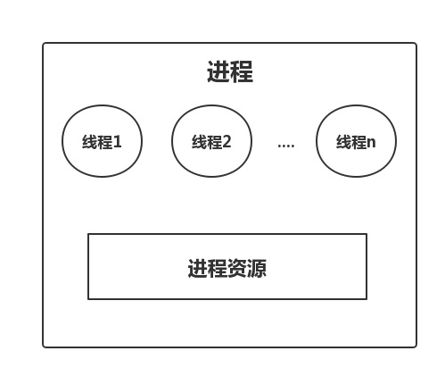

#### 为什么说线程调度比进程调度开销更小

### 进程与线程的差异

- 进程是操作系统中资源分配的最小单位
    - 进程拥有资源但是这些资源不属于某一个线程，因为线程共享进程的资源
    - 同一个进程内的所有线程都使用相同的资源
- 线程是操作系统中调度的最小单位
- 当我们 fork 一个新的进程时，“伴生”了一个线程。这个唯一的线程代表了当前进程参与到了任务调度。
- 进程与线程在 Linux 中的实现

    struct task_struct {
    	...
    	struct mm_struct *mm; /*内存资源*/
    	...
    }

### 任务调度的开销

- 如何区分进程调度与线程调度

    进程调度：使用不同资源的`struct task_struct`之间的调度

    线程调度：使用相同资源的`struct task_struct`之间的调度

- 任务调度的开销主要有什么
    - 进程上下文的切换开销
    - 任务调度后，CPU Cache/TLB 不命中，导致缺页中断的开销
- 为什么说线程调度比进程调度开销小
    - 对于上下文的切换，进程调度与线程调度都是必须的
    - 开销的差异主要在第二点：线程的调度都是使用相同资源的`struct task_struct` 之间的调度，线程切换后 CPU Cache/TLB 的命中几率就会大。进程切换之后 CPU 中的 cache 就不适用了，没命中就意味着触发了缺页中断，开销自然就会多。